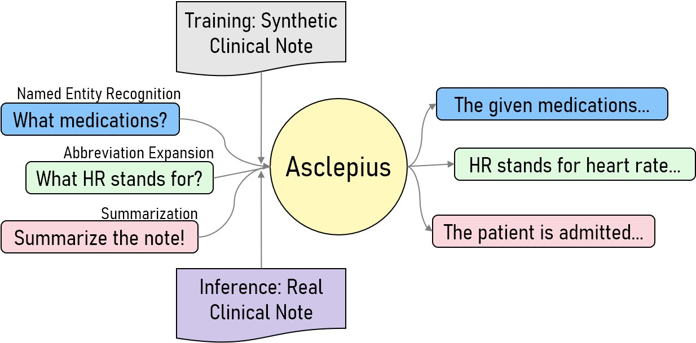
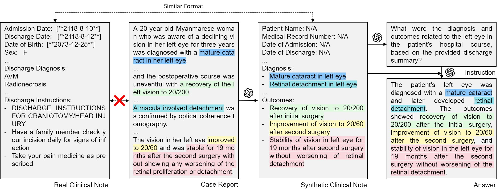

# Asclepius: Publicly Shareable Clinical Large Language Model Built on Synthetic Clinical Notes


[](https://opensource.org/licenses/MIT)
[](https://www.python.org/downloads/release/python-390/)
[](https://github.com/psf/black)
  <p align='center'>
    
  </p>

<br/>

## UPDATE
We are excited to introduce the new Asclepius, based on __Llama2__! 
You can find these models at the links below:
- [Asclepius-Llama2-7B](https://huggingface.co/starmpcc/Asclepius-Llama2-7B)
- [Asclepius-Llama2-13B](https://huggingface.co/starmpcc/Asclepius-Llama2-13B)

----

We introduce the first shareable clinical large language model, **Asclepius**.
The development of large language models tailored for handling patients' clinical notes is often hindered by the limited accessibility and usability of these notes due to strict privacy regulations.
To address these challenges, we trained our model, **Asclepius**, on synthetic clinical notes generated from publicly available case reports extracted from biomedical literature.
On GPT-4 and expert evaluation, our model shows comparable performance to the model trained on real clinical notes.
The model checkpoints and data are publicly available via huggingface.

- [Paper](https://arxiv.org/abs/2309.00237)
- [Asclepius-7B](https://huggingface.co/starmpcc/Asclepius-7B)
- [Asclepius-13B](https://huggingface.co/starmpcc/Asclepius-13B)
- [Synthetic Clinical Notes & Instruction Dataset](https://huggingface.co/datasets/starmpcc/Asclepius-Synthetic-Clinical-Notes)


<p align='center'>

<div align="center">Data Synthesis Pipeline</div>
</p>


## How To use
```python
prompt = """You are an intelligent clinical languge model.
Below is a snippet of patient's discharge summary and a following instruction from healthcare professional.
Write a response that appropriately completes the instruction.
The response should provide the accurate answer to the instruction, while being concise.

[Discharge Summary Begin]
{note}
[Discharge Summary End]

[Instruction Begin]
{question}
[Instruction End] 
"""

from transformers import AutoTokenizer, AutoModel
tokenizer = AutoTokenizer.from_pretrained("starmpcc/Asclepius-7B", use_fast=False)
model = AutoModel.from_pretrained("starmpcc/Asclepius-7B")

note = "This is a sample note"
question = "What is the diagnosis?"

model_input = prompt.format(note=note, question=question)
input_ids = tokenizer(model_input, return_tensors="pt").input_ids
output = model.generate(input_ids)
print(tokenizer.decode(output[0]))
```


## Data
Our synthetic discharge summaries, and corresponding instruction-answer pairs are available on [huggingface](https://huggingface.co/datasets/starmpcc/Asclepius-Synthetic-Clinical-Notes).
Due to the license issue of [MIMIC-III](https://mimic.mit.edu) dataset, instruction-answer pairs used for Asclepius-R will be available via physionet.


## Reproducing Guide
Our models, Asclepius-7B and Asclepius-13B is available on huggingface ([7B](https://huggingface.co/starmpcc/Asclepius-7B), [13B](https://huggingface.co/starmpcc/Asclepius-13B)).
Asclepius-R will be available via physionet.

<details>
<summary>Environment Setup</summary>

```
conda create -n asclepius python=3.9 -y
conda activate asclepius
conda install pytorch torchvision torchaudio pytorch-cuda=11.8 -c pytorch -c nvidia -y
pip install pandarallel pandas jupyter numpy datasets sentencepiece openai wandb accelerate tiktoken transformers==4.32.0
```
</details>

<details>

<summary> Note Synthesis </summary>

- Convert PMC-Patients to GPT input 

  `python preprocessing/pmc_preprocessing.py --input_path {PMC-Patients.csv path} --save_path {A}`
- Run OpenAI API

  `python preprocessing/openai_parallel_request.py --input_path {A} --save_path {B} --request_url {OPENAI_API_ENDPOINT} --api_key {OPENAI_API_KEY}`
- Postprocess OpenAI API output

  `python preprocessing/pmc_postprocessing.py` --input_path {B} --save_path {C}`

<summary> Instruction Generation </summary>

- To use MIMIC-III instead of synthetic notes

  `python preprocessing/mimiciii_preproc.py --input_path {NOTEEVENTS.csv path} --save_path {C}`
- Make Instructions

  `python preprocessing/bootstrapping.py --input_path {C} --save_path {D} --request_url {OPENAI_API_ENDPOINT} --api_key {OPENAI_API_KEY}`
- Postprocess Instructions

  `python preprocesisng/postproc_questions.py --input_path {D} --save_path {E}`
- Make Answers

  `python preprocessing/openai_parallel_request.py --input_path {E} --save_path {F} --request_url {OPENAI_API_ENDPOINT} --api_key {OPENAI_API_KEY}`
- Postprocess Answers

  `python preprocessing/make_instruction_dataset.py --input_path {F} --save_path {G}`


<summary> Pretraining </summary>

- Note Preprocessing
  - We concatenate all notes with `<eos>` tokens.
  - `$ python src/tokenize_data.py --input_path {C} --save_path {H}`
- Run Pretriaining (for 8x A6000 gpus)
  - Adjust `nproc_per_node`, `gradient accumulate step`, `per_device_train_batch_size` to fit to your hardware (global batch size=128).
  ```
  $ torchrun --nproc_per_node=8 --master_port={YOUR_PORT} \
      src/train.py \
      --model_name_or_path "decapoda-research/llama-7b-hf" \
      --data_path {H} \
      --bf16 True \
      --output_dir {I} \
      --num_train_epochs 1 \
      --per_device_train_batch_size 2 \
      --per_device_eval_batch_size 2 \
      --gradient_accumulation_steps 8 \
      --evaluation_strategy "no" \
      --save_strategy "steps" \
      --save_steps 1000 \
      --learning_rate 2e-5 \
      --weight_decay 0. \
      --warmup_ratio 0.03 \
      --lr_scheduler_type "cosine" \
      --logging_steps 1 \
      --fsdp "full_shard auto_wrap" \
      --fsdp_transformer_layer_cls_to_wrap 'LlamaDecoderLayer' \
      --tf32 True \
      --model_max_length 2048 \
      --gradient_checkpointing True
  ```
</details>


<details>
<summary>Instruction Finetuning</summary>

```
    $ torchrun --nproc_per_node=8 --master_port={YOUR_PORT} \
        src/instruction_ft.py \
        --model_name_or_path {I} \
        --data_path {G} \
        --bf16 True \
        --output_dir ./checkpoints \
        --num_train_epochs 3 \
        --per_device_train_batch_size 2 \
        --per_device_eval_batch_size 2 \
        --gradient_accumulation_steps 8 \
        --evaluation_strategy "no" \
        --save_strategy "epoch" \
        --learning_rate 2e-5 \
        --weight_decay 0. \
        --warmup_ratio 0.03 \
        --lr_scheduler_type "cosine" \
        --logging_steps 1 \
        --fsdp "full_shard auto_wrap" \
        --fsdp_transformer_layer_cls_to_wrap 'LlamaDecoderLayer' \
        --tf32 True \
        --model_max_length 2048 \
        --gradient_checkpointing True
        --ddp_timeout 18000
```

</details>


<details>
<summary>Evaluation</summary>

- Evaluate Models
  ```
  python src/evaluate.py \
    --model_name {I} \
    --input_path {J} \
    --save_path {K}
  ```

- Run GPT-4 for evaluation
 
  ```
  python eval/gpt4_evaluate.py --input_path {K} --save_path {L} 
  ```
</details>

## Citation
```
@misc{kweon2023publicly,
    title={Publicly Shareable Clinical Large Language Model Built on Synthetic Clinical Notes},
    author={Sunjun Kweon and Junu Kim and Jiyoun Kim and Sujeong Im and Eunbyeol Cho and Seongsu Bae and Jungwoo Oh and Gyubok Lee and Jong Hak Moon and Seng Chan You and Seungjin Baek and Chang Hoon Han and Yoon Bin Jung and Yohan Jo and Edward Choi},
    year={2023},
    eprint={2309.00237},
    archivePrefix={arXiv},
    primaryClass={cs.CL}
}
```
## Code References
- [Stanford Alpaca](https://github.com/tatsu-lab/stanford_alpaca)
- [Minimal-LLaMA](https://github.com/zphang/minimal-llama)
- [Vicuna](https://github.com/lm-sys/FastChat)
- [Clinical-T5](https://www.physionet.org/content/clinical-t5/1.0.0/)
